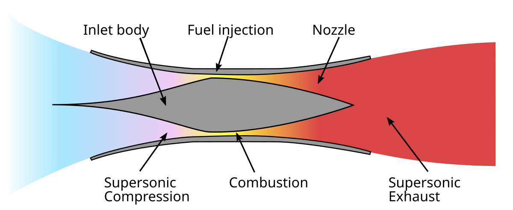

# Scramjet (Supersonic Combustion Ramjet)

A **scramjet** is a type of airbreathing jet engine designed to operate at **hypersonic speeds** (Mach 5 and above). Unlike traditional jet engines, scramjets have **no rotating parts** and rely entirely on high-speed airflow for compression and combustion.

---

## 🚀 How Scramjets Work

1. **Air Intake**  
   As the vehicle travels at hypersonic speed, air is compressed as it enters the intake due to the shock waves caused by its high velocity.

2. **Supersonic Combustion**  
   Unlike ramjets (where the airflow slows to subsonic speeds), scramjets allow **supersonic airflow throughout the engine**. Fuel (typically hydrogen) is injected and burned while the air is still moving at supersonic speed.

3. **Thrust Generation**  
   The expanding hot gases are accelerated through a nozzle to produce thrust, propelling the vehicle forward.

---

## 🔍 Key Characteristics

- **No Moving Parts** – simpler and lighter than turbojets.
- **Requires Initial Speed** – scramjets can’t operate from a standstill; they need to be boosted to high speed first.
- **Works Best at Mach 5–15** – beyond this range, efficiency drops.

---

## ✨ Applications

- **Hypersonic missiles**
- **High-speed experimental aircraft** (e.g., NASA X-43)
- **Potential future spaceplanes** for orbital launches

---

## 📈 Advantages

✅ High efficiency at hypersonic speeds  
✅ Lightweight due to absence of turbines  
✅ Potential for reusable space access systems  

---

## ⚠️ Challenges

❌ Must be launched by another system (like a rocket or turbojet)  
❌ Materials must withstand extreme heat  
❌ Fuel-air mixing and combustion at supersonic speed is complex

---

## 🖼️ Diagram

---

## 📚 References

- NASA Scramjet Program – [https://www.nasa.gov](https://www.nasa.gov)
- X-43A Scramjet Flight – [Wikipedia: NASA X-43](https://en.wikipedia.org/wiki/NASA_X-43)

---
